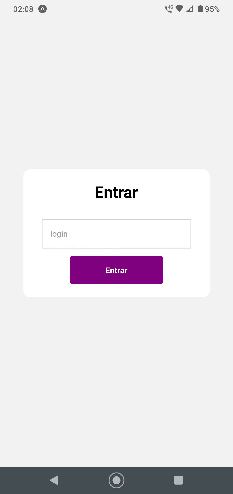
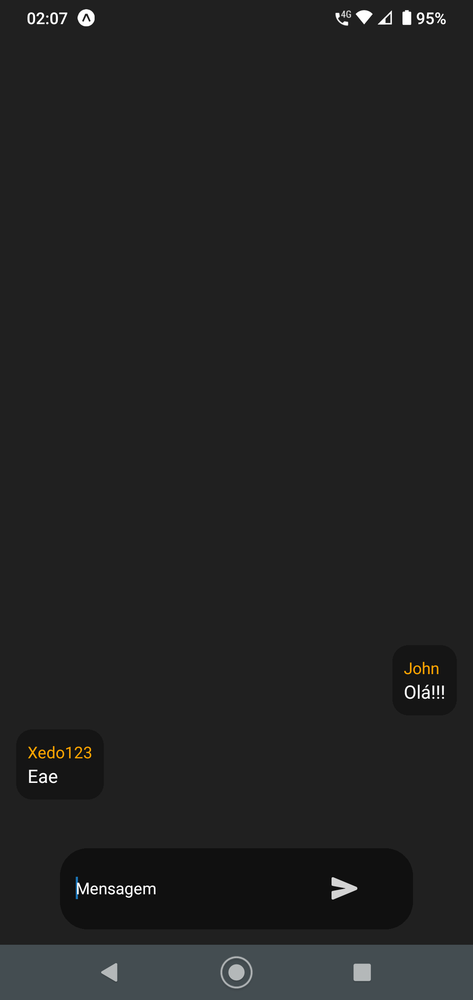

# App chat

Este projeto foi desenvolvido com o objetivo de compreender a comunicação em tempo real.
Para isso, utilizei React Native, visando aprimorar meus conhecimentos em desenvolvimento mobile híbrido, e Nest.js, para fins de aprendizado. O aplicativo foi testado apenas em dispositivos Android.

## Pré-visualização do App

<div align="center">
  
  
</div>

## Rodar o projeto:

### Frontend:
- Renomeie o arquivo `.env.example` para `.env` e configure as variáveis de ambiente.

```
yarn
yarn start
```

### Server:

```
yarn
yarn start:dev
```

## Vídeo de demonstração

<a href='https://fqvdbgearwiwcebrpbop.supabase.co/storage/v1/object/public/file/app-chat.mp4'>Clique aqui para assistir ao vídeo de demonstração<a/>
